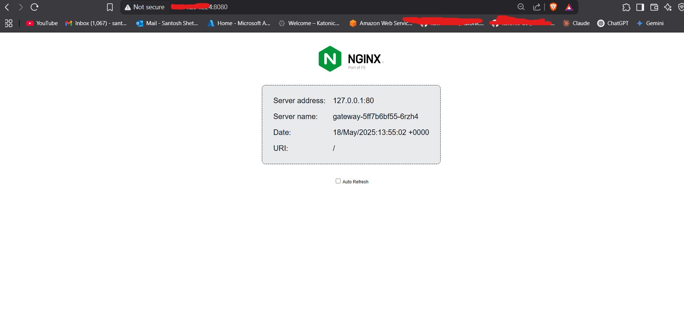
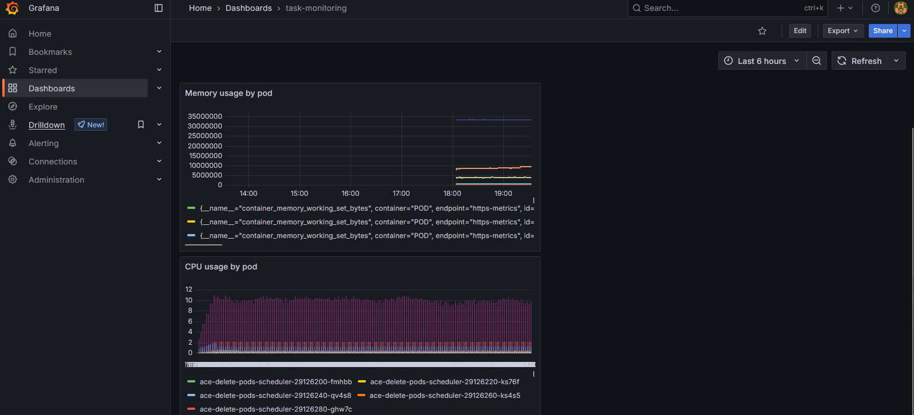

# 🛡️ MinIO IAM-like Access Simulation in Kubernetes

This project simulates AWS IAM-style access control within a Kubernetes environment using MinIO. It ensures that only authorized services can interact with object storage, while others are explicitly denied—even if they are misconfigured with credentials.

---

## 📦 Components

- **MinIO** (`minio/minio`) deployed in a dedicated namespace: `storage-system`
- **Two Kubernetes services**:
  - ✅ `data-service`: Authorized to access the MinIO bucket
  - ❌ `auth-service`: Denied access (even with credentials)
- **MinIO IAM-like user and bucket policies**
- ✅ Optional: Integrate network policies for extra enforcement
- Deploy monitoring

---

## Project File structure
```test
├── 01-minio-deployment.yaml
├── 02-secrets.yaml
├── 03-services-deployment.yaml
├── 04-minio-setup-job.yaml
├── 05-access-test-jobs.yaml
├── 06-networkpolicy.yaml
├── README.md
├── monitoring
│   ├── custom-grafana-dashboard.json
│   ├── serviceMonitor-for-auth-service.yaml
│   ├── serviceMonitor-for-data-service.yaml
│   ├── serviceMonitor-for-gateway.yaml
│   └── serviceMonitor-for-minio.yaml
├── monitoring.sh
├── service-monitor.yml
├── test-pod.yaml
```

## 🚀 Setup Instructions

### 1. Create Namespaces, Secrets and minio

```bash
kubectl apply -f 01-minio-deployment.yaml
```

Includes:
- storage-system namespace for MinIO
- Root credentials for MinIO
- Access credentials for data-service
- Deploys a single‐node MinIO server with console and API ports
- Exposes API (port 9000) and Console (port 9001)


### 2. Create ServiceAccounts

```bash
kubectl apply -f 02-service-accounts.yaml
```

Includes:
- Creates the app-system namespace
- Defines secrets for data-service and auth-service to access MinIO
- Mirrors these secrets into the storage-system namespace for the setup job

### 3. Deploy Workloads

```bash
kubectl apply -f 03-services-deployment.yaml
```
Includes:
- Deploys data-service (http-echo) and auth-service (httpbin) in app-system
- Configures each pod with MINIO_ACCESS_KEY, MINIO_SECRET_KEY, and MINIO_ENDPOINT
- Adds liveness/readiness probes and resource requests/limits
- Deploys a simple gateway service and an Ingress to front the gateway




### 4. Configure MinIO Policies & Bucket

```bash
kubectl apply -f 04-minio-setup-job.yaml
```
This Job will:
- Batch Job in storage-system to configure MinIO after startup
- Create the app-data bucket
- Adds MinIO users for data-service and auth-service
- Defines and attaches appropriate policies (full access for data-service, deny-all for auth-service)

### 5. Run Access Tests
```bash
kubectl apply -f 05-access-test-jobs.yaml
```
Tests:
Two Batch Jobs in app-system to verify credentials:
  - test-data-service-access: should succeed uploading to app-data
  - test-auth-service-access: should fail listing (access denied)


### 6. Apply Network Policies

Defines NetworkPolicies to restrict traffic:

  - Deny all ingress to MinIO by default
  - Allow only data-service pods to reach MinIO API/console
  - Restrict auth-service egress to only data-service and DNS


### 7. Access the minio dashboard

Port-forward to minio service

```bash
kubectl port-forward svc/minio -n storage-system 9001:9001 --address 0.0.0.0
```

Check bucket, users and policies


### 8 Deploy monitoring and Create dashboards

#### Architecture Overview


Note: Follow monitoring.sh file to deploy monitoring

📊 Dashboard Configuration
Import Pre-built Dashboard

Open Grafana (http://localhost:3000)
Login with admin credentials
Click "+" → "Import"
Paste the dashboard JSON from grafana-dashboard.json
Click "Load" → "Import"

Dashboard Features
The included dashboard provides:

CPU Usage: Real-time CPU consumption per pod
Memory Usage: Memory utilization across services
Pod Restarts: Color-coded restart counts with thresholds
Pod Status: Current status of all monitored pods

Key Metrics Monitored
|     Metric    |        Description       |                       Query Example                       |
|:-------------:|:------------------------:|:---------------------------------------------------------:|
| CPU Usage     | CPU cores used per pod   | sum(rate(container_cpu_usage_seconds_total[5m])) by (pod) |
| Memory Usage  | Working set memory in MB | container_memory_working_set_bytes / 1024 / 1024          |
| Pod Restarts  | Container restart count  | kube_pod_container_status_restarts_total                  |
| HTTP Errors   | 4xx/5xx error rate       | `rate(http_requests_total{code=~"4..                      |

🎨 Creating Custom Panels
Method 1: Using Grafana UI

1. Create Panel: Dashboard → "Add panel" → "Add a new panel"
2. Choose Visualization: Graph, Stat, Table, Gauge, etc.
3. Configure Query: Select Prometheus data source and enter PromQL
4. Customize: Set axes, colors, thresholds, legends
5. Save: Click "Apply" then save dashboard





### Link to the Loom video for this task: 
https://www.loom.com/share/8fc82fe98bf347d5a9263be9d7ac8e7c?sid=ee03f1e1-d439-415a-84c5-3185f4b5de91