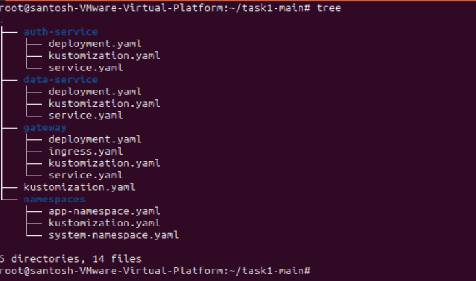
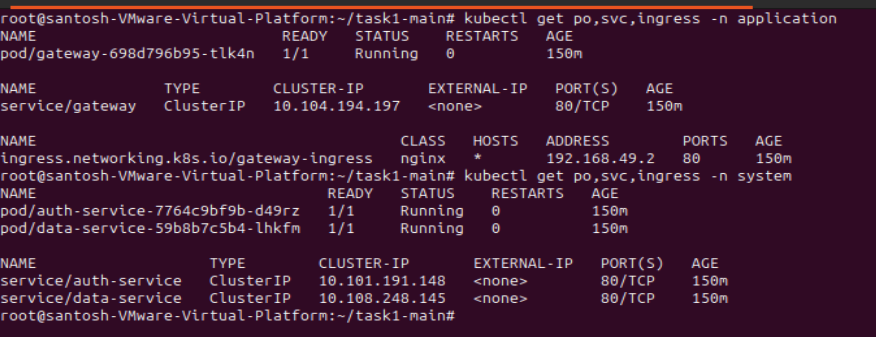
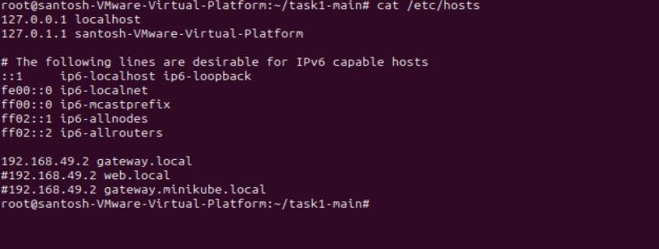
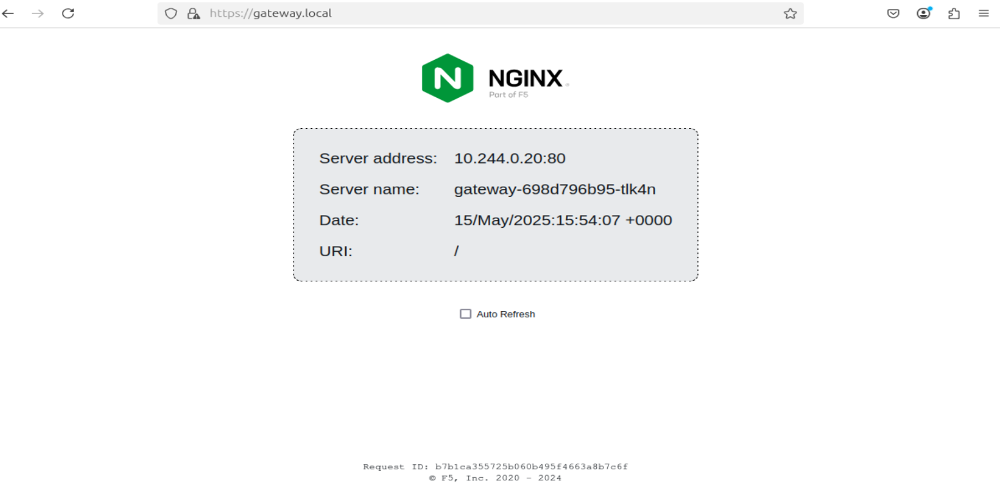
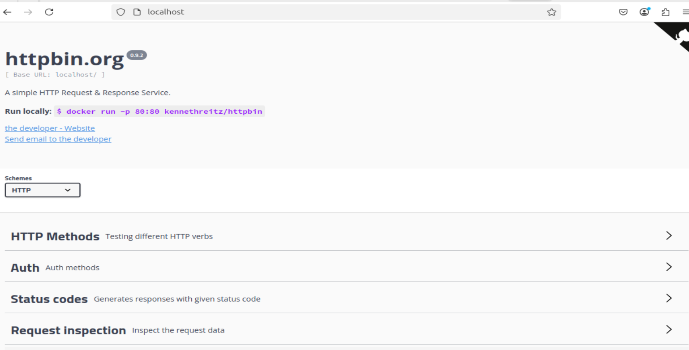

# Microservice Stack Deployment with Kustomize for Minikube

This repository contains a Kubernetes deployment of a simple three-service microservice architecture using Kustomize. It is designed to run on Minikube and demonstrates namespace separation, resource management, health checks, and ingress.

## Directory Structure

```
task1/
   ├── namespaces/
   │   ├── kustomization.yaml       # Kustomize setup for namespaces
   │   ├── system-namespace.yaml    # "system" namespace definition
   │   └── app-namespace.yaml       # "application" namespace definition
   ├── gateway/
   │   ├── kustomization.yaml       # Kustomize setup for gateway
   │   ├── deployment.yaml          # Deployment for the gateway service
   │   ├── service.yaml             # ClusterIP service for the gateway
   │   └── ingress.yaml             # Ingress rule exposing gateway
   ├── auth-service/
   │   ├── kustomization.yaml       # Kustomize setup for auth-service
   │   ├── deployment.yaml          # Deployment for the auth microservice
   │   └── service.yaml             # ClusterIP service for auth-service
   ├── data-service/
   │   ├── kustomization.yaml       # Kustomize setup for data-service
   │   ├── deployment.yaml          # Deployment for the data microservice
   │   └── service.yaml             # ClusterIP service for data-service
   └── kustomization.yaml           # Aggregates all base resources
```

## Components

* **Namespaces**

  * `system` for internal services (auth, data).
  * `application` for the public-facing gateway.

* **Gateway**

  * Uses an NGINX demo image to serve incoming HTTP requests.
  * Exposed via a Kubernetes Ingress.
  * Configured with liveness and readiness probes, and resource requests/limits.

* **Auth Service**

  * Uses the `kennethreitz/httpbin` image to simulate an authentication endpoint.
  * Internal-only (ClusterIP) in the `system` namespace.
  * Health checks ensure reliability.

* **Data Service**

  * Uses `hashicorp/http-echo` to return a simple text response.
  * Internal-only (ClusterIP) in the `system` namespace.
  * Health checks and resource management similar to other services.

## How to Deploy on Minikube

1. **Start Minikube**

   ```bash
   minikube start
   ```
   

2. **Enable Ingress Add-on**

   ```bash
   minikube addons enable ingress
   ```

3. **Deploy the Stack**

   ```bash
   kubectl apply -k ./
   ```

4. **Verify Resources**

   ```bash
   # Namespaces
   kubectl get ns

   # Deployments
   kubectl get deployments -n application
   kubectl get deployments -n system

   # Services
   kubectl get svc -n application
   kubectl get svc -n system

   # Ingress
   kubectl get ingress -n application
   ```
   


5. **Access the Gateway**

   ```bash
   minikube ip
   ```
   Set up minikube ip in /etc/hosts

   ```
   192.168.49.2 gateway.local
   ```

   

   Open your browser to `http://gateway.local/` to see the gateway response.

   

6. You can access internal application as well using port forwarding of their services

   
   
   
## Notes

* Services in different namespaces communicate via DNS, e.g., `auth-service.system.svc.cluster.local`.
* Only the gateway is exposed externally; internal services use `ClusterIP`.
* Resource requests/limits prevent any one container from starving others.
* Health probes (liveness/readiness) ensure pods are healthy before receiving traffic.

---

Feel free to customize replicas, images, or resource settings to suit your needs.
