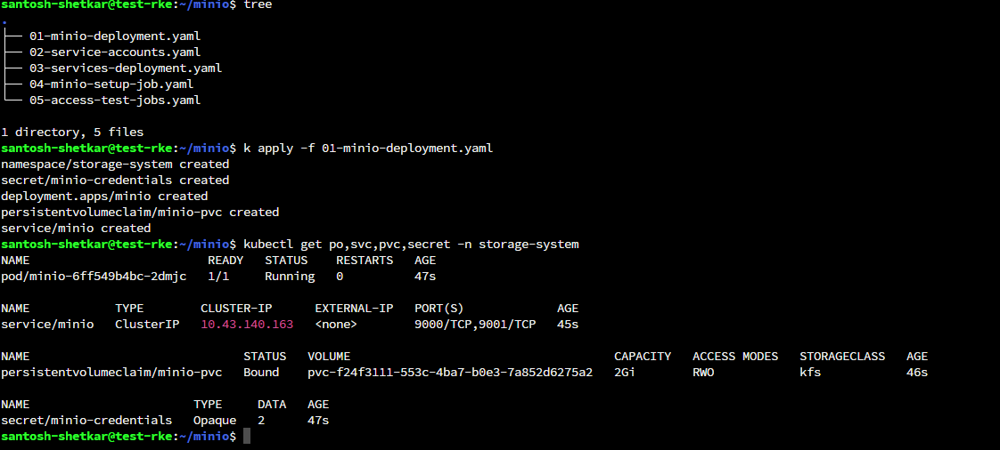
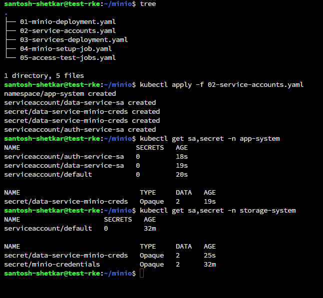
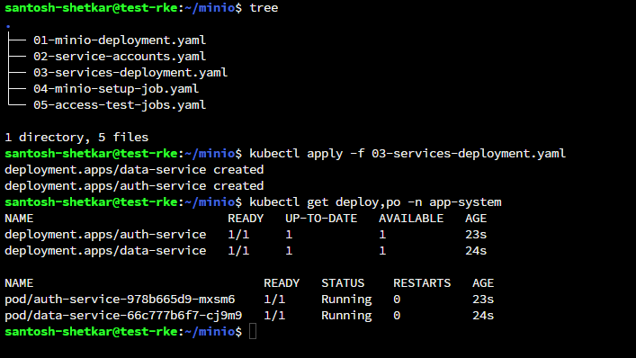
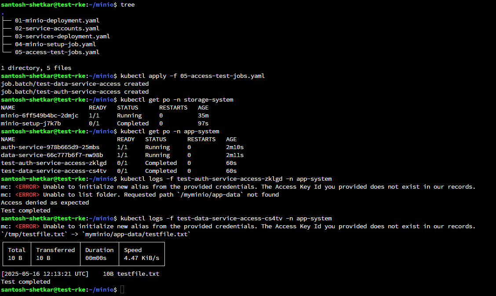
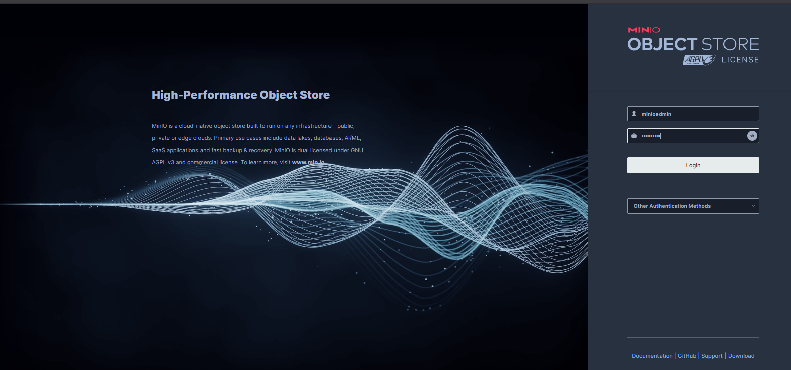
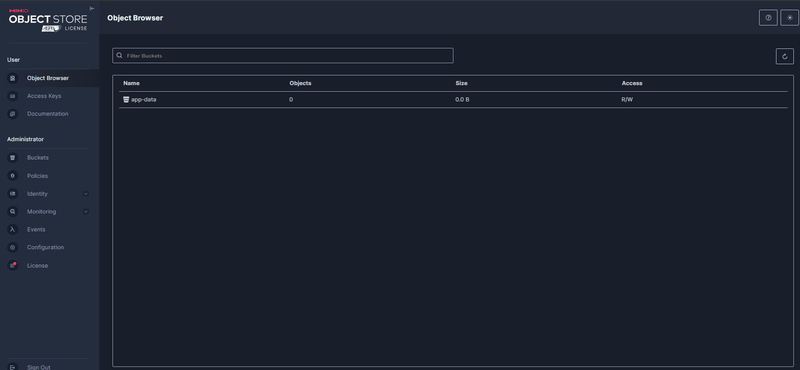

# 🛡️ MinIO IAM-like Access Simulation in Kubernetes

This project simulates AWS IAM-style access control within a Kubernetes environment using MinIO. It ensures that only authorized services can interact with object storage, while others are explicitly denied—even if they are misconfigured with credentials.

---

## 📦 Components

- **MinIO** (`minio/minio`) deployed in a dedicated namespace: `storage-system`
- **Two Kubernetes services**:
  - ✅ `data-service`: Authorized to access the MinIO bucket
  - ❌ `auth-service`: Denied access (even with credentials)
- **MinIO IAM-like user and bucket policies**
- ✅ Optional: Integrate policy engines like OPA or Kyverno for extra enforcement

---

## 🚀 Setup Instructions

### 1. Create Namespaces, Secrets and minio

```bash
kubectl apply -f 01-minio-deployment.yaml
```

Includes:
- storage-system namespace for MinIO
- app-system namespace for workloads
- Root credentials for MinIO
- Access credentials for data-service
- Deployment with persistent volume
- Exposes API (port 9000) and Console (port 9001)

  

### 2. Create ServiceAccounts

```bash
kubectl apply -f 02-service-accounts.yaml
```

Includes:
- data-service-sa
- auth-service-sa
  

### 3. Deploy Workloads

```bash
kubectl apply -f 03-services-deployment.yaml
```
Includes:
- data-service: Configured with valid MinIO credentials
- auth-service: Lacks access permissions
  

### 4. Configure MinIO Policies & Bucket

```bash
kubectl apply -f 04-minio-setup-job.yaml
```
This Job will:
- Create the app-data bucket
- Create a MinIO user: data-service-user
- Attach a scoped IAM-like policy to allow access to that user only
  

### 5. Run Access Tests
```bash
kubectl apply -f 05-access-test-jobs.yaml
```
Tests:
✅ test-data-service-access: Uploads and lists objects in the bucket

❌ test-auth-service-access: Fails with "Access Denied"
  

### 5. Access the minio dashboard

Port-forward to minio service

```bash
kubectl port-forward svc/minio -n storage-system 9001:9001 --address 0.0.0.0
```




### Link to the Loom video for this task: 
https://www.loom.com/share/6d3c19e5ee4a4f4d8806a0c4a08d69a9?sid=284e5f46-8144-4c88-8774-7b50ec1e643a
